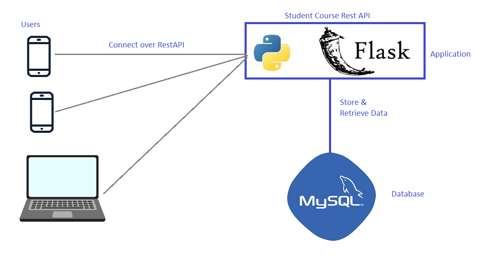

# StudentCoursesRestAPI
This Project consists of flask example with mysql connectivity

This project will be used to demonstrate APIs and Docker connectivity in the subsequent versions

## Architecture of the Application

